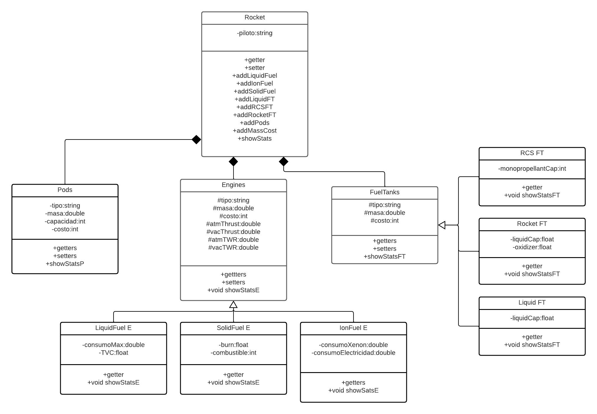

# Proyecto-Kerbal-Space-Program-VAB

## Proyecto Orientado a Objetos

## Diagrama de clases

### Descripción

El Proyecto Kerbal Space Program VAB, se basa en un simulador del VAB (Vehicle-Assembly-Building) de el juego original, el cual consiste en una version simplificada que permite al usuario crear un cohete y escoger sus componentes, ya sean los motores, los Pods, los tanques de combustible, los accesorios cientificos, etc.. 

Cada cohete tiene sus estadisticas base las cuales cambiaran y seran afectadas dependiendo de los componentes seleccionados.

### Funcionalidad

El programa constara con un menu, del cual el usuario elegira las opciones deseadas y finalmente podra desplegar las estadisticas finales del cohete, las cuales se mostraran en pantalla.
